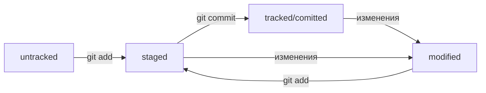

# Git
Git - система контроля версий.

## Основные команды
* pwd - вывести путь к директории.
* cd имя.папки - перейти в папку.
* cd ~ - перейти к домашней директории.
* ls - вывести содержимое текущей директории.
* ls -a - вывести все файлы текщей директории, включая скрытые.
* ls ~ - вывести содержимое домашней директории.
* ls .. - вывести содержимое родительской директории.
* touch имя.файла - создать файл, хорошо бы указывать расширение файла.
* mkdir имя.директории - создаст папку в текущей директории. Перед именем можно указать дом. дир. или родит. дир. (~/имя.дир , или ../имя.дир , или ../../имя.дир).
* cp что.копир куда.копир - копирование файла/файлов.
* mv что.переносить куда.переносить - перенос файла/файлов.
* cat имя.файла -  чтение текстового файла.
* rm имя.файла - удаление файла/файлов.
* rmdir - удаление пустой папки.
* rmdir -r - рекурсивное удаление папки (удалятся все файлы в ней поочередно).
* git init - делает текущую папку репозиторием.
* git -rf .git - "разгитить" папку.
* git status - выведет текущее состояние изменений.
* git add - подготовка файла/файлов к сохранению.
* git commit -m 'Сообщение' - сохранение версии файлов.
* git log - история коммитов.
* git push - отправка изменений на удаленный репозиторий.
* git clone адрес.репозитория - скопировать репозиторий на локальный компьютер.
* git remote add origin скопированный.ssh.адрес.репозитория - связать локальный репозиторий с удаленным.

## Полезные советы
- Выполнение сразу нескольких команд при помощи амперсандов &&.
- Вызов команд из буфера при помощи стрелочек вверх/вниз.
- Использовать автозаполнение при помощи Tab.

## Хеш, лог, HEAD

### Хеш
Хеширование (hash - "рубить", "крошить", "мешанина") - способ преобразовать набор данных и получить их "отпечаток".
Информация о коммите - набор данных: когда был сделан коммит, содержимое файлов в репозитории на момент коммита и ссылка на предыдущий (родительский) коммит. Git хеширует эту информацию с помощью алгоритма SHA-1 и получает для каждорго коммита свой уникальный хеш - результат хеширования.
Git хранит таблицу соответствий хеш+информация о коммите и хеши в служебных файлах, которые находятся в скрытой папке .git в репозитории проекта.
##H4Важные совйства хеша:
* если хеш получить дважды для одного и того же набора данных, то результат будет одинаковым;
* если хоть что-то в данных поменяется (хоть 1 символ), то хеш тоже изменится (причём конкретно).

### Лог
После вызова git log появляется список коммитов с их описанием, которое состоит из:
* хеш коммита;
* Author - имя автора и его электронная почта;
* Date - дата и время создания коммита;
* Сообщение к коммиту.
Сокращённый лог вызывают командой git log с флагом --oneline.

### HEAD
Файл HEAD - один из служебных файлов папки .git. Он указывает на коммит, который был сделан последним (т. е. самый новый).

## Статусы файлов
- untracked (неотслеживаемый);
- staged (подготовленный);
- tracked (отслеживаемый);
- modified (изменённый).

### Жизненный цикл файла в Git

